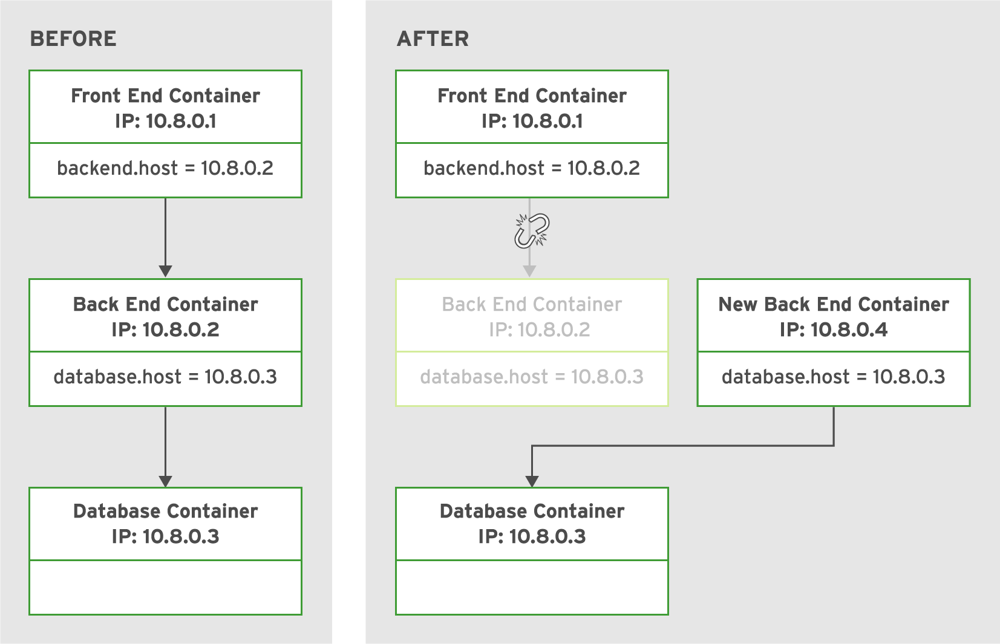
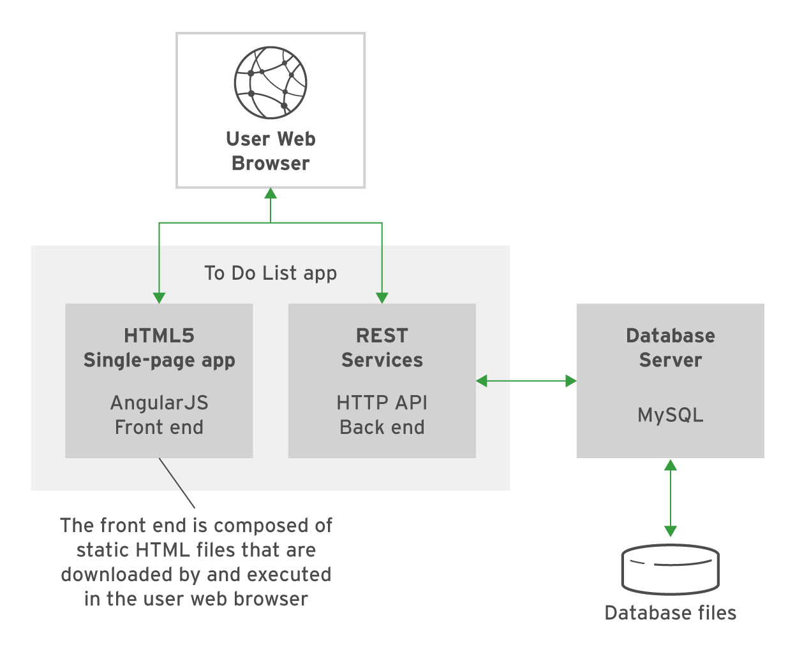

## **`Abstract: `**

The objective of this guy is to cover deployments of multicontainer applications using **`podman`**.

-  **`Table of contents`:**
	- [Understing Multicontainer Deployments](#understanding-multicontainer-deployments)
	- [Example](#example)

#### **`Understanding Multicontainer Deployments:`**
- **`Podman`** uses Container Network Interface **`(CNI)`** to create a software-defined network **`(SDN)`** between all containers in the host.
- **`CNI`** assigns a new IP address to a container when it starts.
- Each container exposes all ports to other containers in the same **`SDN`** making services accessible within the same network. 
- Ports within the containers are exposed externally only when explicitly configured.
- Due to the dynamic nature of container **`IP addresses`**, applications cannot rely on either fixed IP addresses or fixed DNS host names to communicate with middleware services and other application services. 
- Containers with dynamic IP addresses can become a problem when working with multi-container applications because each container must be able to communicate with others to use services upon which it depends.

> *Example*
Examine an example of an application which is comprised of a front-end, back-end, and a database, all of which are containers of their own. The front-end container needs to retrieve the IP address of the back-end container. Similarly, the back-end container needs to retrieve the IP address of the database container. Additionally, the IP address could change if a container restarts, so a process is needed to ensure any change in IP triggers an update to existing containers.



#### **`Example: `**
This example walks through building a multicontainer application using **`podman`** from a high-level. The application as illustrated below,is based on **`node.js`** front-end , **`REST`** backend, and **`MySQL`** database for storage.



- Change into directory containining **`Dockerfile`** of the **`MySQL`** image, and build that.
```bash 
#build sql image
$ sudo podman build -t do180/mysql-rhel7 --layers=false .
```
- Change into directory containing **`Dockerfile`** of the **`node.js`** image, and build it as well.
```zsh
$ sudo podman build -t do180/nodejs --layers=false .
```
- Build **`Node.js`** child image.
```zsh
$ ./build.sh
```
- Verify that the images were build successfully.
```zsh
$ sudo podman images \
	 --format "table {{.ID}} {{.Repository}} {{.Tag}}"
```

